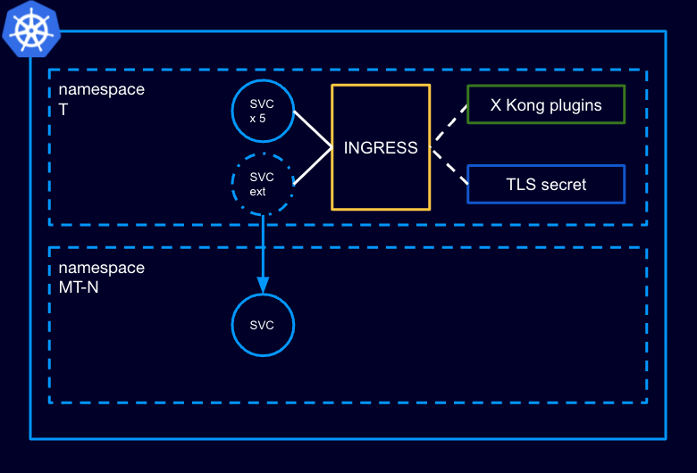

The Helm chart will deploy a number of namespaces, ingresses, services and Kong plugins that match the design that we have decided on in "Option 4" of https://perzoinc.atlassian.net/wiki/spaces/GMC/pages/2367069425/Ingress+resource+management.

## Kong objects

According to the above design, the chart will deploy, where T is the number of tenants, N the number of MT services and M the number of ST services:
* T+N namespaces
* T ingresses
* T*(N+M)+N services
* T Kong plugins (request transformer)

## Load test

If it is enabled, the load test will be done by spinning a number of pods which will curl the Kong proxy service on a random route, with a random hostname.
